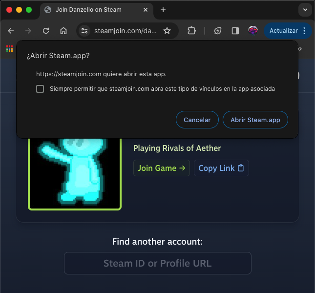

[](https://steamjoin.com)

A website to generate shortened + permanent Steam join game lobby links. Built with [Go](https://go.dev/), [go-chi](https://go-chi.io/), and [TailwindCSS](https://tailwindcss.com/).

Parses Steam API responses and uses [Steam browser protocol](https://developer.valvesoftware.com/wiki/Steam_browser_protocol) to redirect into Steam on success. Utilizes go-chi dynamic routing and JavaScript to unify search and redirect implementation.



## Development

[Tailwind standalone CLI](https://tailwindcss.com/blog/standalone-cli) is required for styling.

During development, run
```sh
./tailwindcss -i ui/base.css -o ui/static/style.css --watch
```

Compile and minify for production with
```sh
./tailwindcss -i ui/base.css -o ui/static/style.css --minify
```
